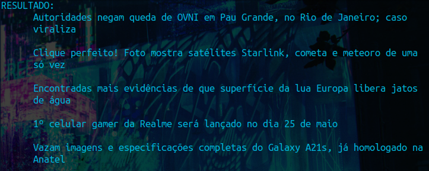
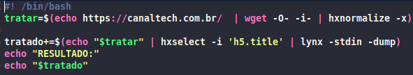
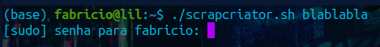

# web-scrap creator
um algoritmo em ShellScript que é capaz de criar outro algoritmo para realizar web scrapping de um determinado serviço, bastando informar o nome de saída do algoritmo, o site, e os seletores css.

## usando como exemplo abaixo o canal tech
temos aqui a nossa tela de inicio, ele irá te pedir informações necessárias para a criação do pequeno algoritmo:

  

em seguida ele irá criar o algoritmo, e iniciar ele para testar:

  

arquivo de saída criado pelo algoritmo:

  

para realizar a instalação de dependências, basta digitar o nome dele, seguido de qualquer coisa.

  
 

